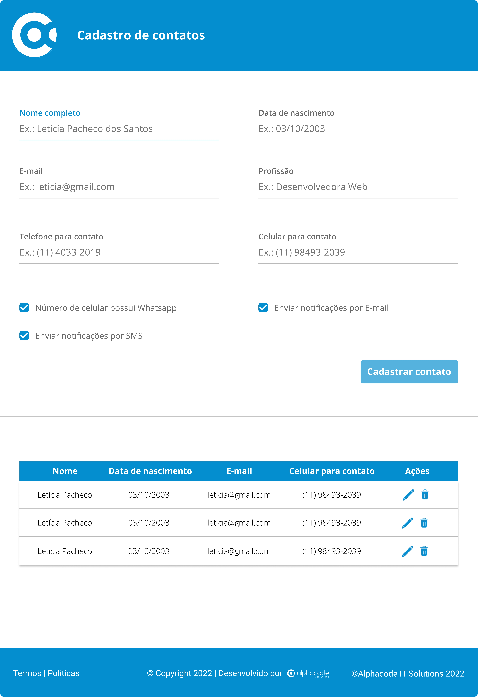

<h1 align="center">
     Teste de conhecimento prático 
</h1>

<h4 align="center"> 
	🚧  crud de contatos 🚀 Concluído 🚀 🚧
</h4>

<p align="center">
 <a href="#-sobre-o-projeto">Sobre</a> •
 <a href="#-funcionalidades">Funcionalidades</a> •
 <a href="#-layout">Layout</a> • 
 <a href="#-como-executar-o-projeto">Como executar</a> • 
 <a href="#-tecnologias">Tecnologias</a> • 
 <a href="#-autor">Autor</a> • 
</p>


## 💻 Sobre o projeto

Contatos - Criar um CRUD de uma tela de contatos, realizando suas devidas funcionalidades, sendo elas: Criar, listar, atualizar e deletar.


Projeto desenvolvido para teste prático a empresa [Alphacode](https://site.alphacode.com.br/) :office:

---

## ⚙️ Funcionalidades

- [x] Os Usuários podem cadastrar os contatos na plataforma web enviando os seguintes dados:
  - [x] Nome completo
  - [x] Data de nascimento
  - [x] Email
  - [x] Profissão, segue exemplo: 
    - Desenvolvedora fullstack
    - Devops
    - Gerente de projetos
    - Tech Lead

- [x] Os usuários tem acesso a uma tabela com todos os contatos cadastrados
- [x] Os usuários podem realizar a edição dos dados de um determinado contato
- [x] Os usuários pode realizar a exlusão de um determinado contato

---

## 🎨 Layout

layout da aplicação:

### Web

<p align="center" style="display: flex; align-items: flex-start; justify-content: center;">
  
</p>

---

## 🚀 Como executar o projeto

Este projeto é divido em duas partes:
1. Backend (pasta backend) 
2. Frontend (pasta frontend)

💡O Frontend precisa que o Backend esteja sendo executado para funcionar.

### Pré-requisitos

Antes de começar, você vai precisar ter instalado em sua máquina as seguintes ferramentas:
[Git](https://git-scm.com), [PHP](https://www.php.net/), [Laravel](https://laravel.com/), [Composer](https://getcomposer.org/), [Angular](https://angular.io/). 
Além disto é bom ter um editor para trabalhar com o código como [VSCode](https://code.visualstudio.com/)

#### 🎲 Rodando o Backend (servidor)

```bash

# Clone este repositório
$ git clone https://github.com/jennifer-cristina/contacts-crud

# Acesse a pasta do projeto no terminal/cmd
$ cd contacts-crud

# Vá para a pasta da aplicação Back End
$ cd backend

# Instale as dependências
$ npm install

# Execute a aplicação em modo de desenvolvimento
$ php artisan serve

# O servidor inciará na porta:8000 - acesse http://localhost:8000 

```

#### 🧭 Rodando a aplicação web (Frontend)

```bash

# Clone este repositório
$ git clone https://github.com/jennifer-cristina/contacts-crud

# Acesse a pasta do projeto no seu terminal/cmd
$ cd contacts-crud

# Vá para a pasta da aplicação Front End
$ cd frontend

# Instale as dependências
$ npm install

# Execute a aplicação em modo de desenvolvimento
$ ng serve

# A aplicação será aberta na porta:4200 - acesse http://localhost:4200

```

---

## 🛠 Tecnologias

As seguintes ferramentas foram usadas na construção do projeto:

#### **Website**  ([Angular](https://angular.io/)  +  [Bootstrap](https://getbootstrap.com/))

-   **[ngx-mask](https://github.com/JsDaddy/ngx-mask)**
-   **[angular-input-masks](https://github.com/assisrafael/angular-input-masks)**
-   **[rxjs](https://github.com/ReactiveX/rxjs)**

> Veja o arquivo  [package.json](https://github.com/jennifer-cristina/contacts-crud/blob/main/frontend/package.json)

#### **Server**  ([PHP](https://www.php.net/)  +  [Laravel](https://laravel.com/))

-   **[Axios](https://axios-http.com/ptbr/docs/intro)**

> Veja o arquivo  [package.json](https://github.com/jennifer-cristina/contacts-crud/blob/main/backend/package.json)

#### **Utilitários**

-   Editor:  **[Visual Studio Code](https://code.visualstudio.com/)**
-   Commit Conventional:  **[Commitlint](https://github.com/conventional-changelog/commitlint)**
-   Teste de API:  **[Postman](https://www.postman.com/)**
-   Fontes:  **[Roboto](https://fonts.google.com/specimen/Roboto)**

---

## 🦸 Autora

<a href="https://github.com/jennifer-cristina">
 

[](https://www.linkedin.com/in/jennifer-cristina-221437207/) 
[](mailto:cristin4.jennifer@gmail.com)

---

Feito com ❤️ por Jennifer Cristina 👋🏽 [Entre em contato!](https://www.linkedin.com/in/jennifer-cristina/)

---
